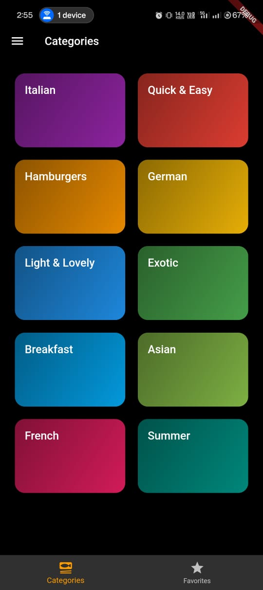
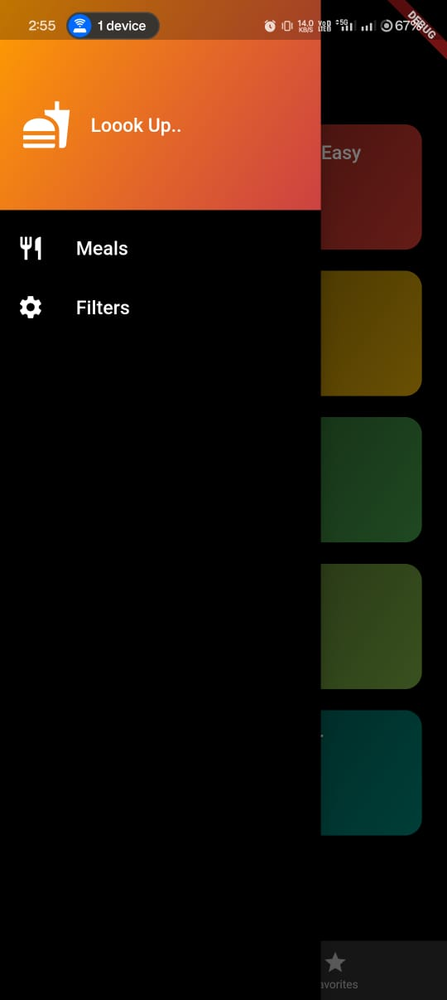

# 🍽️ Meals App

A Flutter-based Meals App that helps users explore meal categories, view recipes, and mark favorites. Users can switch between categories and favorites using bottom navigation or swipe gestures.

---

## 📷 Screenshots
 ---     ---

<!-- Add your actual screenshot path -->

---
## Demo
[Watch Demo Video](.Demo_app)

## 🚀 Features
✅ View meals categorized by type  
✅ Check detailed recipes for each meal  
✅ Mark meals as favorites  
✅ Switch between **Categories** and **Favorites** using **BottomNavigationBar** or **swipe gestures**  
✅ Apply filters like **Gluten-Free, Vegan, Vegetarian, and Lactose-Free**  

---

## 🛠️ Installation

### **Prerequisites**
- Flutter SDK installed
- Android Studio or VS Code
- A device/emulator to run the app

### **Steps to Run the App**
1. **Clone the Repository**
   ```sh
   git clone https://github.com/kevinpaulson7/meals_app.git
   cd meals_app

2. **Add Dependencies**
   ```sh
   flutter pub get

3. **Run the App**
   ```sh
   flutter run

### **PROJECT STRUCTURE**
```sh
   meals_app/
│── lib/
│   ├── screens/                # All Screens (Categories, Favorites, Filters, Meals)
│   ├── models/                 # Data models (Meal, Filter) 
|   |──providers/               # Providers for providing the meals and other filters.  
│   ├── data/                   # Dummy data
│   ├── widgets/                # UI Components
│   ├── main.dart               # App entry point
│── assets/                     # App assets (images, icons)
│── pubspec.yaml                # Dependencies & configurations
│── README.md                   # Project documentation
